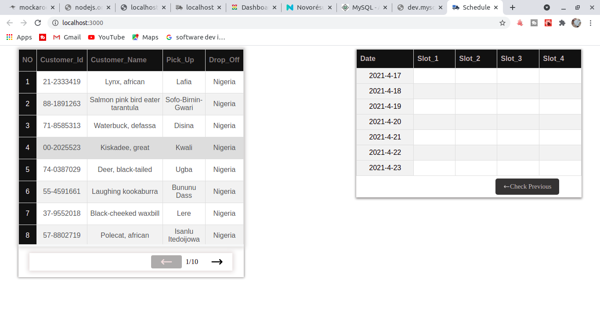
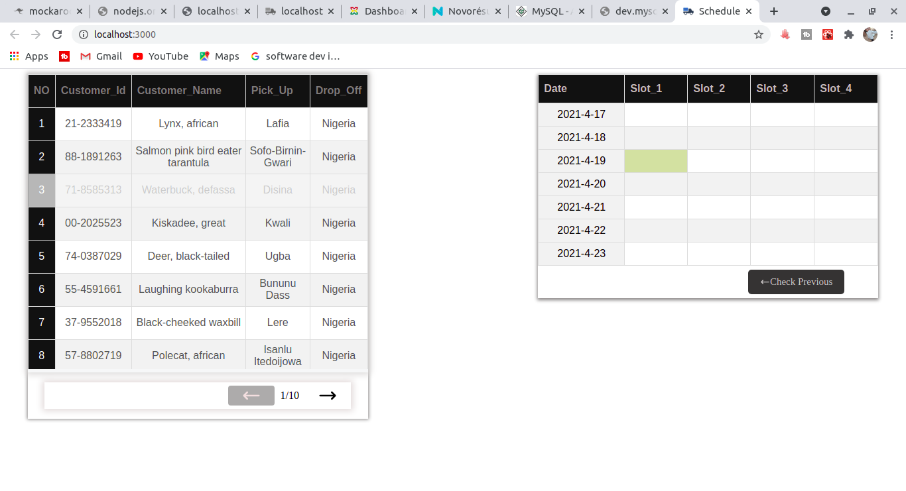
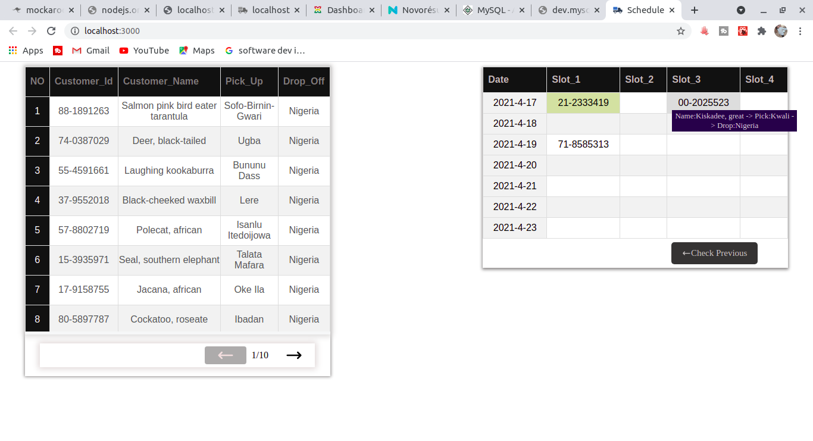

# DeliverySlot 
* This is a page app that has a list of customers in a table as for the left, just as you can see in the image found in the shot below:

* And on the right, yu can see the list is slots available.
the operator will be able to drag a customer and fix them in an available slot in the right just as you can see in the image below:

* The incase if the user wants to view the customer with id placed in the slot, the you just have hover over the id: just as u can see below:

**All this will be stored in the database on each drop:**

### The date updates 7days ahead.

##### To run the project, you just have to download or fork the project, after that, run npm start to open the project in your local machine.